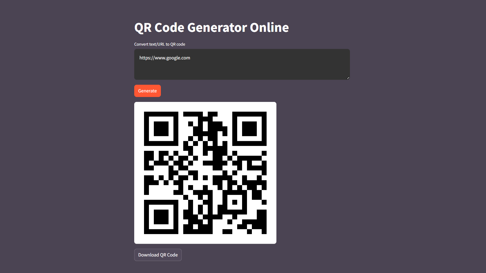

# QR Code Generator Online

Easily generate QR code online!

QR Code Generator Online is a web app made with Streamlit  used to generate QR code.



[](https://qrcodegeneratoronline.streamlit.app)

## 🌐 Run Online
1. Go to [qrcodegeneratoronline.streamlit.app](https://qrcodegeneratoronline.streamlit.app) .
2. Paste your **text/URL**.
3. Click on **Generate** button.
4. To download, click on the **Download** button *(optional)*.

## 🖥️ Run Locally
1. Clone the repository.
```sh
git clone https://github.com/nilaysarma/QR-Code-Gen-Online.git
```

2. Install the required packages. Creating a virtual environment is recommended.
```sh
pip install -r requirements.txt
```
3. Run the app using streamlit.
```sh
streamlit run main.py
```
4. It should open it in your browser at `localhost:8501` .

## 📄 LICENSE
This repository is licensed under the [MIT License](LICENSE).